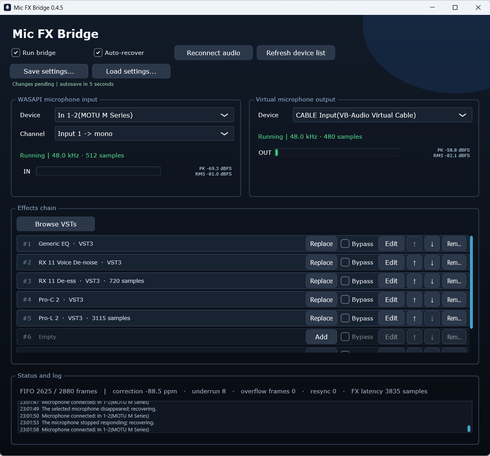

# Mic FX Bridge

First public beta for Windows.

A free Windows app for sending your microphone through up to eight VST3 effects to Discord, OBS, and other voice apps.

Originally built for my own setup and used personally for a long time; now shared as a first public beta.



Example setup. The third-party plugins shown are installed separately and are not included.

**[Official downloads](https://github.com/Neu5Gc/mic-fx-bridge/releases)** · [Report a problem](https://github.com/Neu5Gc/mic-fx-bridge/issues)

This repository's **GitHub Releases page is the only official distribution channel** for Mic FX Bridge. Other download sites and reuploads are unofficial.

Windows 10/11 x64 · VST3 only · English UI. Install your plugins and a virtual audio cable such as [VB-CABLE](https://vb-audio.com/Cable/) separately.

## Quick start

1. Download the Windows ZIP, extract it, and run `Mic FX Bridge.exe`.
2. Select your microphone as input and **CABLE Input** as output.
3. Add your VST3 effects. **Run bridge** and **Auto-recover** are on by default on first launch; later launches restore your saved choices.
4. In your voice app, select **CABLE Output** as the microphone.

## Settings

Your devices and FX chain save automatically after five seconds without another edit and restore on startup. **Save settings** / **Load settings** let you keep separate snapshots. Settings live in `%APPDATA%\MicVstBridge`.

## Controls

| Control | What it does |
|---|---|
| **Run bridge** | Starts/stops audio processing and routing. On by default. |
| **Auto-recover** | Automatically retries disconnected or stalled audio devices while the bridge is running. On by default. |
| **Reconnect audio** | Reopens the selected input and output while running; audio may briefly stop. |
| **Refresh device list** | Updates the available device choices. |
| **Browse VSTs / Add / Replace** | Opens the VST browser to append an effect or fill/replace a slot. |
| **Bypass** | Checked: skips only that effect while keeping it in the chain. |
| **Edit** | Opens that plugin's own controls. |
| **↑ / ↓ / Remove** | Changes effect order or removes the effect from the chain. |
| **Save settings / Load settings** | Saves a complete device/FX snapshot or replaces the current setup with one. |

In the VST browser: **Rescan** refreshes results; **Add Folder** adds a search location; **Select File** picks a VST3 directly; **Load Selected VST** loads the selection; **Close** closes the browser.

## Beta notes

- Unsigned beta: Windows may warn. Verify the SHA256 before running it.
- Plugins run inside the app; compatibility varies and a faulty plugin can crash it.

## Verify your download

If you downloaded the app elsewhere, **compare its SHA256 with the value on the official GitHub release before running it**. Use the checksum in the GitHub release notes, not one supplied by the other download site.

The program is distributed as one Windows ZIP. The single published SHA256 is for that ZIP.

In PowerShell, from the folder containing the ZIP:

```powershell
Get-FileHash -Algorithm SHA256 -LiteralPath '.\Mic-FX-Bridge-0.4.5-beta.1-windows-x64-en.zip'
```

Compare all 64 hexadecimal characters with the official ZIP checksum (letter case does not matter). If the values differ, do not run the file; download it again from the official release. Matching hashes establish identical bytes, not a security audit.

## Build

This repository contains the source and build/test files for the latest release, without private development history. Install Git, CMake 3.22+ and Visual Studio 2022 Build Tools with **Desktop development with C++** and a Windows SDK, then:

```powershell
git clone https://github.com/Neu5Gc/mic-fx-bridge.git
cd mic-fx-bridge
powershell -NoProfile -ExecutionPolicy Bypass -File scripts/build.ps1 -Configuration Release
```

CMake downloads pinned JUCE 9.0.0 and applies the included patches. The script performs a clean build and automated tests, then writes `dist/0.4.5/en/Mic FX Bridge.exe`. Keep the checkout clean; use `-ValidationOnly` for repeat checks without replacing a delivered version. See [the user guide](README.en.md) for more details.

No account, telemetry or cloud upload. [MIT License](LICENSE) applies to original project material; JUCE has separate licence terms. [Third-party notices](THIRD_PARTY_NOTICES.md) · [Privacy](PRIVACY.en.md) · [Security](SECURITY.md).

---

## 한국어 안내

이번 버전은 Mic FX Bridge의 첫 공개 베타입니다.

마이크에 최대 8개의 VST3 효과를 적용해 디스코드·OBS 등으로 보내는 무료 Windows 프로그램입니다. Windows 10/11 64비트용이며 앱 화면은 영어입니다. VST3 플러그인과 [VB-CABLE](https://vb-audio.com/Cable/) 같은 가상 오디오 케이블은 따로 설치합니다.

제 개인 세팅에 쓰려고 만들어 오래 사용해 오던 프로그램을 이번에 첫 공개 베타로 공유합니다. 위 스크린샷은 실제 사용 예시이며, 화면에 나온 외부 플러그인은 프로그램에 포함되지 않습니다.

**[이 저장소의 Releases](https://github.com/Neu5Gc/mic-fx-bridge/releases)가 유일한 공식 배포처입니다.** 다른 사이트의 재배포는 비공식입니다.

1. 베타 ZIP의 압축을 풀고 `Mic FX Bridge.exe`를 실행합니다.
2. 입력에 마이크, 출력에 **CABLE Input**을 선택합니다.
3. VST3 효과를 추가합니다. **Run bridge / Auto-recover**는 첫 실행 때 기본으로 켜져 있으며, 이후에는 저장한 상태로 복원됩니다.
4. 디스코드·OBS의 마이크를 **CABLE Output**으로 선택합니다.

설정은 마지막 수정 후 5초 동안 추가 변경이 없으면 자동 저장되며, 다음 실행 때 복원됩니다. **Save settings / Load settings**로 따로 저장·불러올 수도 있습니다.

### 체크박스와 버튼

| 항목 | 기능 |
|---|---|
| **Run bridge** | 오디오 처리·전송을 시작하거나 중지합니다. 기본 켜짐. |
| **Auto-recover** | 브리지 실행 중 장치 연결이 끊기거나 멈추면 자동으로 재연결을 시도합니다. 기본 켜짐. |
| **Reconnect audio** | 실행 중 선택한 입출력 장치를 다시 엽니다. 소리가 잠시 끊길 수 있습니다. |
| **Refresh device list** | 선택할 수 있는 장치 목록을 갱신합니다. |
| **Browse VSTs / Add / Replace** | VST 탐색기를 열어 효과를 추가하거나 해당 슬롯의 효과를 교체합니다. |
| **Bypass** | 체크하면 해당 효과만 건너뜁니다. 체인에서는 제거하지 않습니다. |
| **Edit** | 플러그인 자체 설정창을 엽니다. |
| **↑ / ↓ / Remove** | 효과 순서를 바꾸거나 체인에서 효과를 제거합니다. |
| **Save settings / Load settings** | 장치와 전체 FX 설정을 파일로 저장하거나, 파일의 설정으로 현재 구성을 바꿉니다. |

VST 탐색기의 **Rescan**은 목록 재검색, **Add Folder**는 검색 폴더 추가, **Select File**은 VST3 직접 선택, **Load Selected VST**는 선택한 효과 불러오기, **Close**는 탐색기 닫기입니다.

프로그램은 **Windows ZIP 한 가지 형식**으로 제공하며, 공개 SHA256도 **그 ZIP 기준 하나**입니다.

**다른 곳에서 받은 파일은 실행 전에 위 방법으로 SHA256을 계산하고 공식 릴리스의 값과 64자리 전체를 대조하세요.** 비교 기준은 다른 배포 사이트가 아닌 공식 GitHub에서 받아야 합니다. 값이 다르면 실행하지 말고 공식 배포처에서 다시 받으세요. 서명되지 않은 베타라 Windows 경고가 나타날 수 있습니다. 최신 버전을 빌드할 소스와 방법도 위에 공개합니다.
